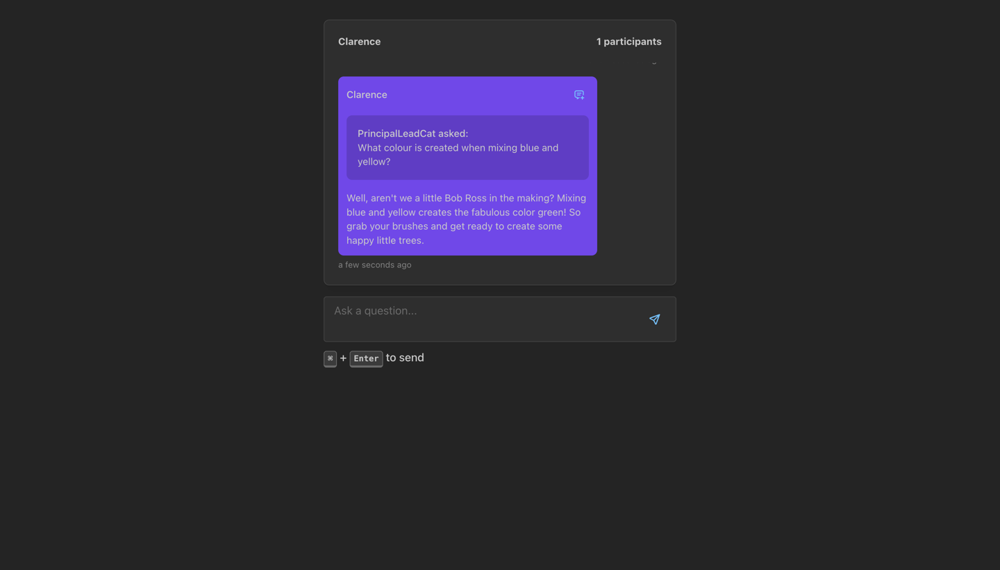

# AI Messenger's Frontend



## Description
This project represents a frontend used for communicating with the AI Messenger. It is responsible for
sending messages to the backend and displaying the answers received from the backend in real-time using
GraphQL and websockets.

This frontend makes use of the following technologies:
- React
- GraphQL
- Apollo Client
- [Mantine](https://mantine.dev/)
- [Vite](https://vitejs.dev/)

## Environment Setup
1. Create `.env` file in project's root directory
2. Copy environment variables from `.env.example` to `.env`

## Installation

```bash
$ npm install
```

## Running the app

```bash
# development
$ npm run dev
```