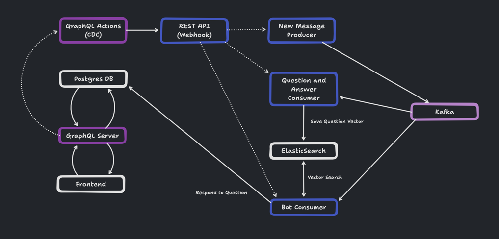
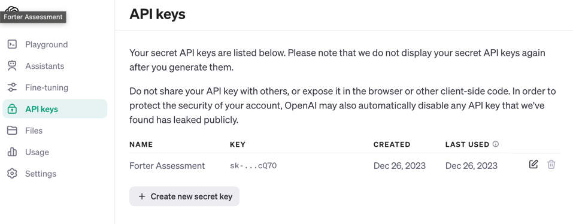
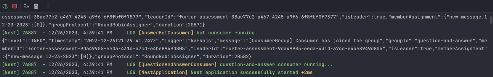

# AI Messenger's Server



## Description
This project represents a server used for processing messages in the AI Messenger. It is responsible for
pushing newly answered questions to ElasticSearch, generating answers based on previously answered questions
and personalizing these answers to make the communication more memorable.

This backend makes use of the following services:
- Hasura
- Hasura Events (Change Detection Capture)
- ElasticSearch
- Kafka
- Prisma
- Postgres
- LangChain
- OpenAI

## Environment Setup
1. Create `.env` file in project's root directory
2. Copy environment variables from `.env.example` to `.env`

You will need to generate the value for the environment variable for `OPEN_AI_API_KEY` [here](https://platform.openai.com/api-keys)
if you don't already have one. OpenAI detects any leaked api keys and removes them from the OpenAI management console.



## Installation

```bash
$ npm install
```

## Running the services

```bash
$ docker-compose up --detach
```

## Database Initialization
```bash
$ npm run prisma:reset
$ npm run prisma:migrate
$ npm run prisma:generate
```

## GraphQL Schema Initialization
```bash
$ npm run hasura:apply
```

## Running the app

```bash
# development
$ npm run start

# watch mode
$ npm run start:dev
```
Kafka will take some time to initialize but the server is ready for processing messages when you see the following:

